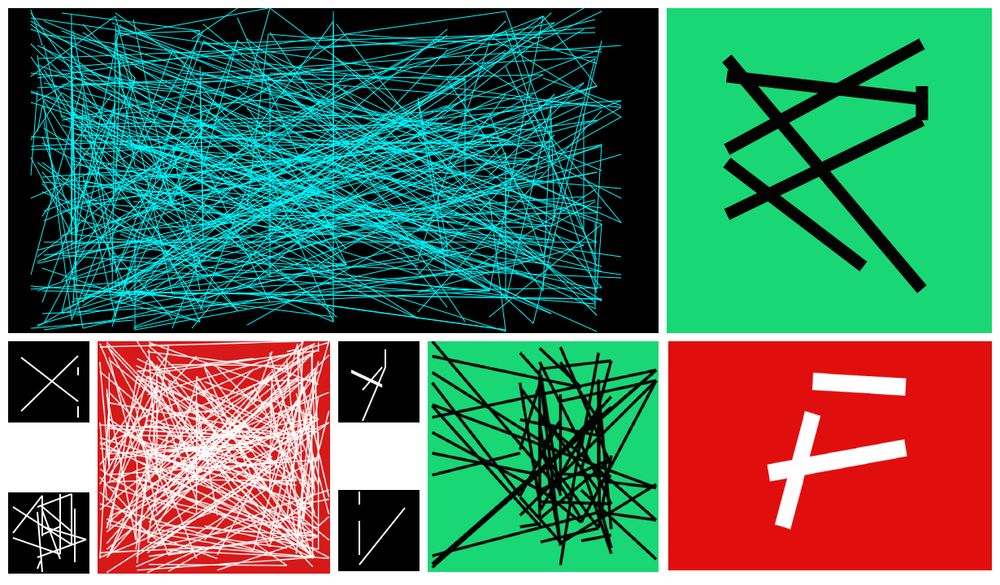

Edgy Icon Generator
---

I made this site to generate 'icons' using random lines. It works a little bit like the [Erdos-Renyi random graph model](https://en.wikipedia.org/wiki/Erd%C5%91s%E2%80%93R%C3%A9nyi_model) in network science. 

A cool use case might be to get random icons for a series of podcasts or any kind of ['drops'](https://mschf.xyz) ;-)

Feel free to try it out at [this site](https://madhav-malhotra.github.io/edgy-icon-generator/index.html). 

P.S. Here are some icons I generated with the tool :-)
